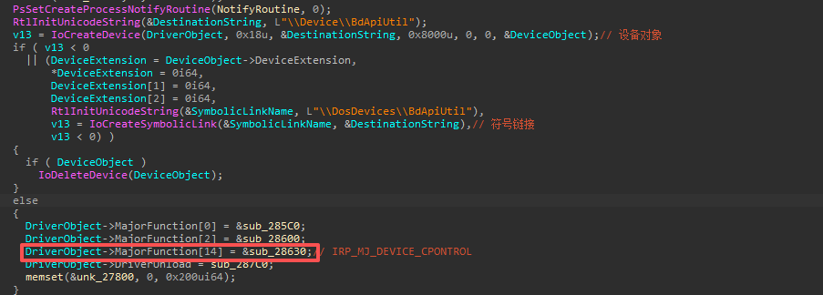
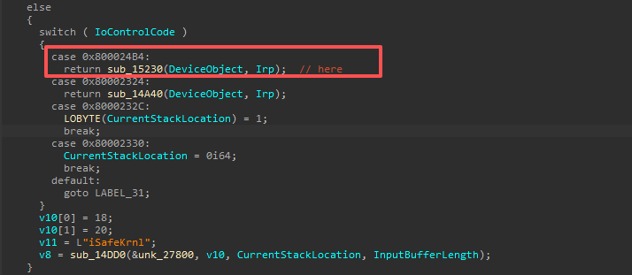
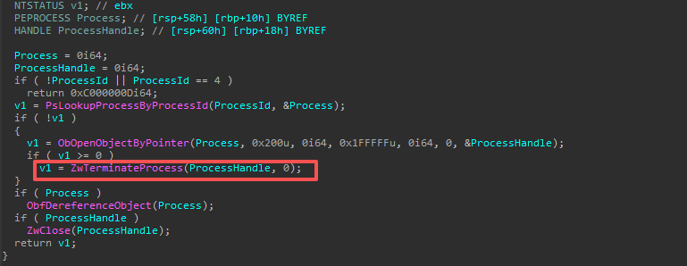

# CVE-2024-51324

前两天看到微步发的文章（https://mp.weixin.qq.com/s/d79eCU9UikVDiLpkafafuQ），一个银狐利用了百度的一个漏洞驱动。刚好最近也在学windows kernel，就分析了一下这个驱动，写一下EXP。当然这个驱动已经被很多杀软拉黑了，主要就是学下驱动EXP编写。

首先找到`IRP_MJ_DEVICE_CONTROL`的派遣函数。

IoControlCode为`0x800024B4`时进入`sub_15230`函数。

此函数接受R3层传入的PID，首先需要确保输入缓冲区为4字节。即一个DWORD类型，刚好表示PID，在调用`sub_152B0`函数。

根据进程PID，先获取此进程句柄，然后经典调用ZwTerminateProcess。

