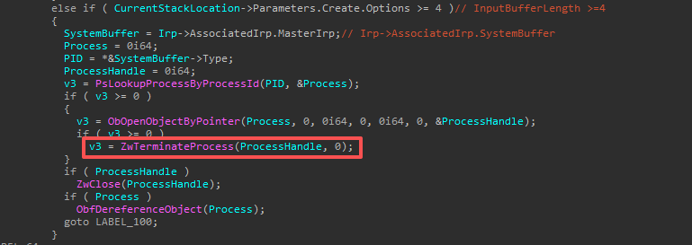
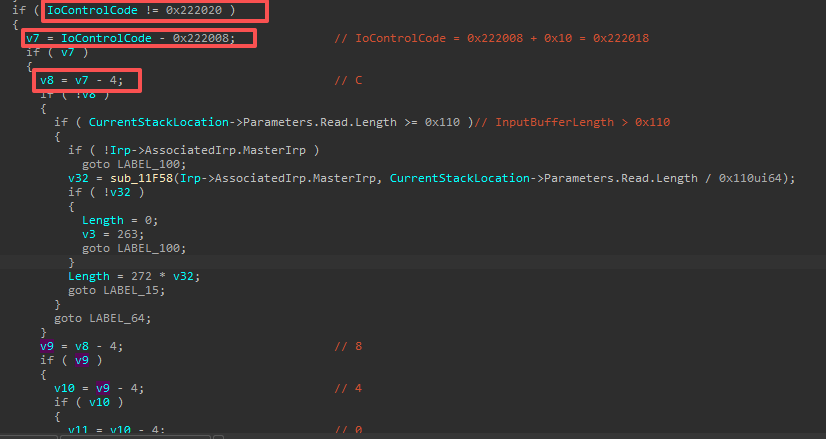

# CVE-2025-1055

找到`IOCTL`派遣的地方，进入`sub_114A0`。

在此函数中定位到关键地方，需要满足InputBufferLength >= 4。往前推出IoControlCode的值为多少进入此分支。

需要`v11`为0。在往前看。

一直往前看到IoControlCode，不难得出此值为`0x222008 + 4 + 4 + 4 + 4 = 0x2222018`。缓冲区传输方式为`METHOD_BUFFERED`，与后面的SystemBuffer对应，完全正确。

