# SKT64.sys分析

分析一个ARK工具（ https://github.com/PspExitThread/SKT64 ），这个工具只有一个exe，运行过程中可能会释放驱动。可以使用360查看释放驱动的位置，可以得到`SKT64.sys`。

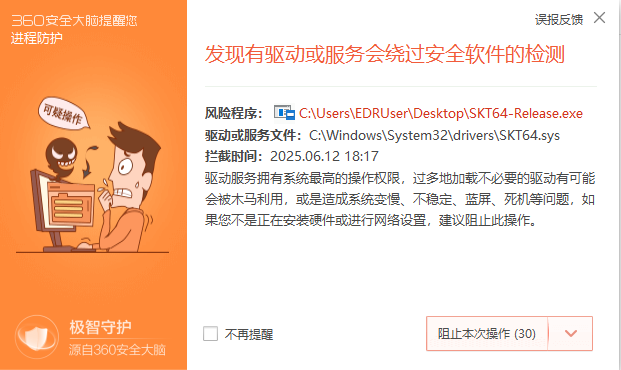

此驱动加了VMProtect壳，难以分析。

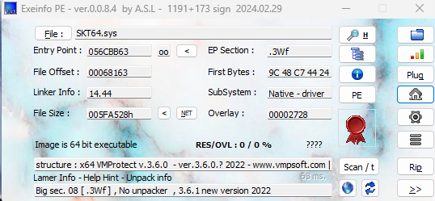

可以看一下原程序，在其中实现了三个函数，名字意思就可以看出是和内核终止程序相关的。

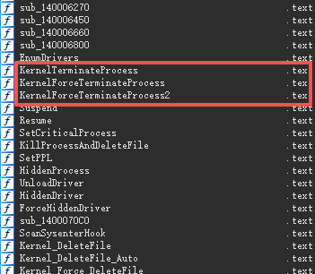

在`KernelTerminateProcess`中向驱动设备对象发出了一个IOCTL请求，猜测用于终止进程。

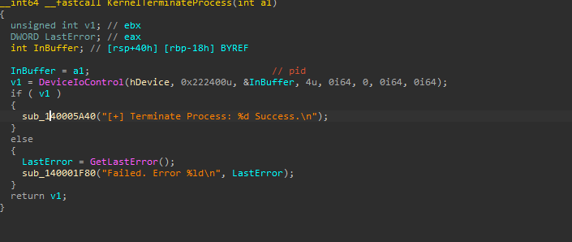

其余两个函数除了IO控制码不一样，其余都一致。

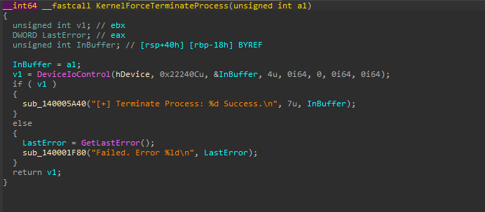

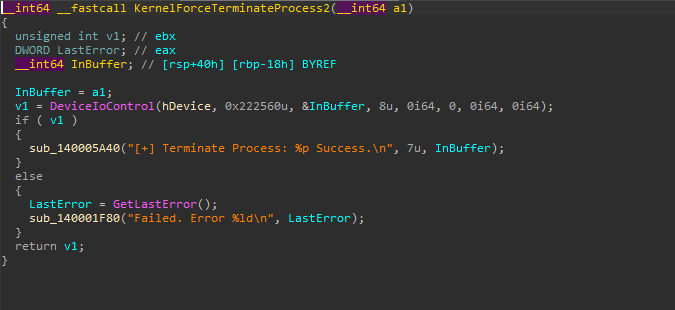

根据在IDA中的偏移，在x64dbg中下这三个函数的断点。例如KernelTerminateProcess断点位置在`7FF60C0C0000 + 69C0 = 7FF60C0C69C0`。

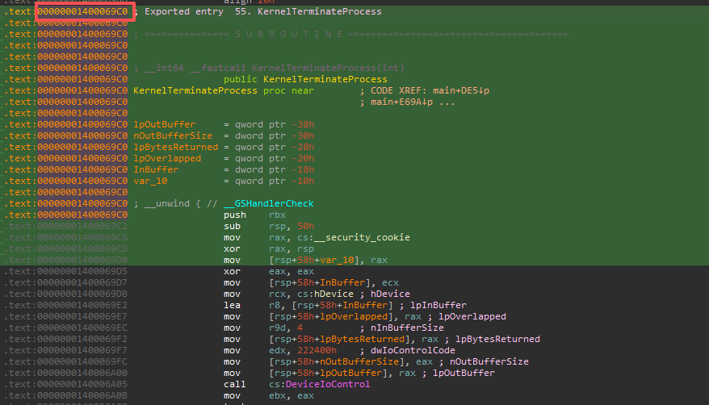

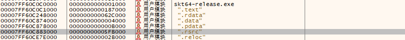

三个地方打上断点后，在x64dbg中进行一些设置，将这些选项全部取消勾选，确保只能运行到我打的条件断点才断下来。

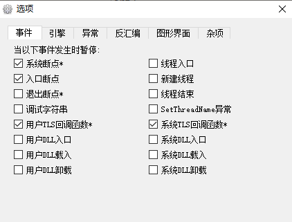

然后重新运行。在启动的界面中，Terminate一个进程。

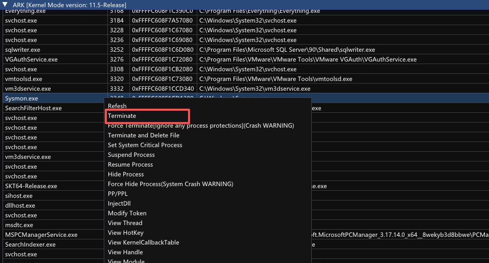

断在了KernelTerminateProcess。

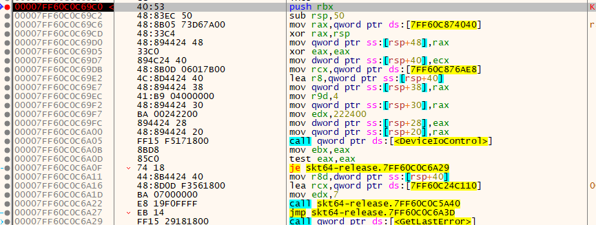

到这里就很明了了。并且通过Winobj可以发现创建的符号链接为`\\.\ArkDrv64`

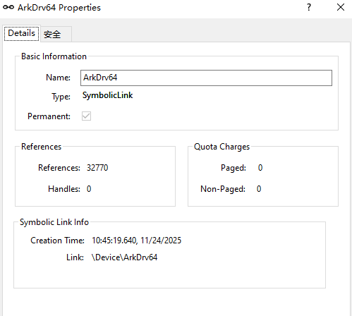

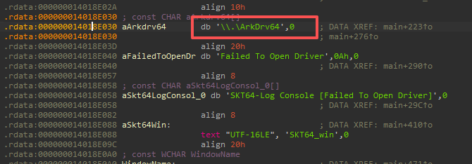